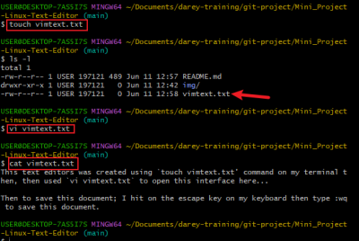
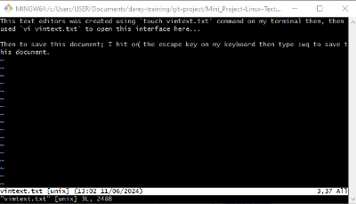
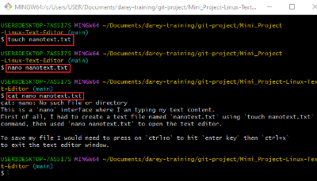
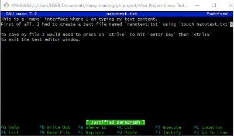

# Mini_Project-Linux-Text-Editor

## This document demonstrates my knowledge of various text editors used in Linux.

### Linux text editors are softwares designed to facilitate text input from users, enabling them to create and edit text files, including scripts and configuration files, to interact with the Linux system using a text-based approach.

Linux offers a variety of text editors, each with its own unique design and features.

## Using `Vim (vi)` Text Editors

`vim` text editor interface

## Using  `nano` text editor

`nano` text editor interface

### The above snapshots illustrate my approach to using various text editors in Linux, demonstrating my understanding of the topic.

